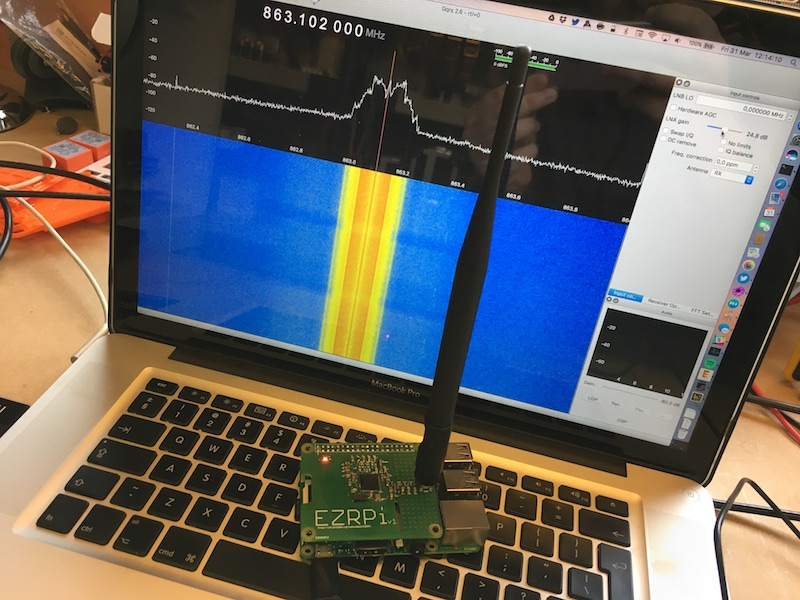

# EZRPi
Raspberry Pi HAT with a Silicon Labs EZR32 Sub-GHz MCU  
Christophe VG (<contact@christophe.vg>)  
[http://christophe.vg/embedded/EZRPi](http://christophe.vg/embedded/EZRPi)

## Introduction

Using the EZRPi HAT one can give access to sub-GHz network protocols to a Raspberry Pi. An example of such protocol is Dash7. Dash7 is a specification for an ultra low power network stack, operating within the sub-GHz spectrum. The [Dash7 Open Source Stack (OSS-7)](https://github.com/MOSAIC-LoPoW/dash7-ap-open-source-stack) can be flashed onto the EZR to turn it into a modem, accessible from the Raspberry Pi. On the Pi, one then could talk to this modem using [pyd7a](https://github.com/MOSAIC-LoPoW/pyd7a) a collection of Python modules, supporting the DASH7 Alliance Protocol in general, and OSS-7 in particular..

This repository contains all design and implementation source files of this generic sub-GHz Raspberry Pi HAT.

## Version 1

On Thursday March 30, I was able to assemble the first EZRPi:


The design includes a standard 868MHz setup of the EZR32 and two LEDs for minimal debugging/feedback.


The board is a 2-layer PCB based on the official Raspberry Pi HAT board specification.


## Software

In the `src/` folder a first small test application is included: [`blink`](src/blink). It requires the `Gecko SDK`, which is included as a submodule in the `lib/` folder.

### OSS-7 Support

As of [Friday March 21](https://github.com/MOSAIC-LoPoW/dash7-ap-open-source-stack/pull/51), the [Dash7 Open Source Stack](https://github.com/MOSAIC-LoPoW/dash7-ap-open-source-stack) now also includes a platform definition for the EZRPi. This makes it super-easy to add Dash7 support to the Raspberry Pi:

```bash
$ git clone https://github.com/MOSAIC-LoPoW/dash7-ap-open-source-stack
Cloning into 'dash7-ap-open-source-stack'...
remote: Counting objects: 39483, done.
remote: Compressing objects: 100% (291/291), done.
remote: Total 39483 (delta 164), reused 0 (delta 0), pack-reused 39191
Receiving objects: 100% (39483/39483), 71.42 MiB | 8.46 MiB/s, done.
Resolving deltas: 100% (27893/27893), done.

$ cd dash7-ap-open-source-stack

$ mkdir build

$ cd build

$ cmake ../stack/ \
        -DCMAKE_TOOLCHAIN_FILE=../stack/cmake/toolchains/gcc-arm-embedded.cmake \
        -DPLATFORM=EZRPi \
        -DAPP_SENSOR_PUSH=on \
        -DFRAMEWORK_LOG_ENABLED=yes \
        -DFRAMEWORK_DEBUG_ASSERT_MINIMAL=y
-- Cross-compiling using gcc-arm-embedded toolchain
-- Cross-compiling using gcc-arm-embedded toolchain
-- The C compiler identification is GNU 4.9.3
-- The CXX compiler identification is GNU 4.9.3
-- Detecting C compiler ABI info
-- Detecting C compiler ABI info - failed
-- Detecting C compile features
-- Detecting C compile features - failed
-- Detecting CXX compiler ABI info
-- Detecting CXX compiler ABI info - failed
-- Detecting CXX compile features
-- Detecting CXX compile features - failed
-- detected supported platforms: EFM32GG_STK3700 EFM32HG_STK3400 EZR32LG_Octa EZR32LG_USB01 EZR32LG_WSTK6200A EZRPi OCTA_Gateway stm32f4_discovery
-- selected platform: EZRPi
-- The ASM compiler identification is GNU
-- Found assembler: /usr/local/bin/arm-none-eabi-gcc
-- Added chip ezr32lg
-- Added chip si4460
-- Configuring done
-- Generating done
-- Build files have been written to: /Users/xtof/dash7-ap-open-source-stack/build

$ make
Scanning dependencies of target CHIP_SI4460
[  1%] Building C object framework/hal/platforms/platform/chips/si4460/CMakeFiles/CHIP_SI4460.dir/si4460.c.obj
...
[ 98%] Building C object apps/sensor_push/CMakeFiles/sensor_push.elf.dir/version.c.obj
[100%] Linking C executable sensor_push.elf
[100%] Built target sensor_push.elf

$ make flash-sensor_push
[ 14%] Built target d7ap
[ 22%] Built target CHIP_SI4460
...
Downloading file [sensor_push.bin]...
Comparing flash   [100%] Done.
Erasing flash     [100%] Done.
Programming flash [100%] Done.
Verifying flash   [100%] Done.
J-Link: Flash download: Flash programming performed for 3 ranges (77824 bytes)
J-Link: Flash download: Total time needed: 1.960s (Prepare: 0.052s, Compare: 0.062s, Erase: 0.933s, Program: 0.896s, Verify: 0.008s, Restore: 0.007s)
O.K.

Loading binary file sensor_push.bin
Reading 81476 bytes data from target memory @ 0x00000000.
Verify successful.

Reset delay: 0 ms
Reset type NORMAL: Resets core & peripherals via SYSRESETREQ & VECTRESET bit.


Script processing completed.

[100%] Built target flash-sensor_push

```

The EZRPi has been tested against the EZR32LG_USB01 and bi-directional communication was achieved.



## Thanks

Although merely a software-implementation option, many thanks go out to the Dash7 Alliance and the OSS-7 team for creating the Dash7 network stack specification in all openness. Special thanks go out to Maarten W. for his support in making this project a reality.
