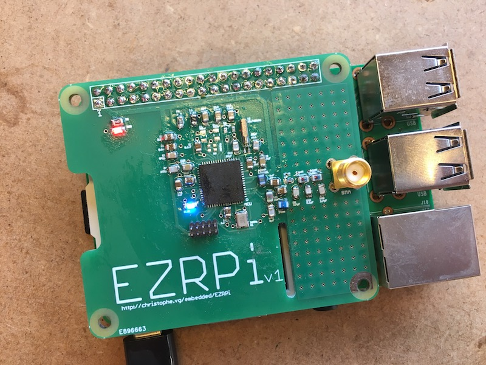

# EZRPi
Raspberry Pi HAT with a Silicon Labs EZR32 Sub-GHz MCU  
Christophe VG (<contact@christophe.vg>)  
[http://christophe.vg/embedded/EZRPi](http://christophe.vg/embedded/EZRPi)

## Introduction

Using the EZRPi HAT one can give access to sub-GHz network protocols to a Raspberry Pi. An example of such protocol is Dash7. Dash7 is a specification for an ultra low power network stack, operating within the sub-GHz spectrum. The [Dash7 Open Source Stack (OSS-7)](https://github.com/MOSAIC-LoPoW/dash7-ap-open-source-stack) can be flashed onto the EZR to turn it into a modem, accessible from the Raspberry Pi. On the Pi, one then could talk to this modem using [pyd7a](https://github.com/MOSAIC-LoPoW/pyd7a) a collection of Python modules, supporting the DASH7 Alliance Protocol in general, and OSS-7 in particular..

This repository contains all design and implementation source files of this generic sub-GHz Raspberry Pi HAT.

## Version 1

On Thursday March 30, I was able to assemble the first EZRPi:

The design includes a standard 868MHz setup of the EZR32 and two LEDs for minimal debugging/feedback.

The board is a 2-layer PCB based on the official Raspberry Pi HAT board specification.

## Thanks

Although merely a software-implementation option, many thanks go out to the Dash7 Alliance and the OSS-7 team for creating the Dash7 network stack specification in all openness. Special thanks go out to Maarten W. for his support in making this project a reality.
