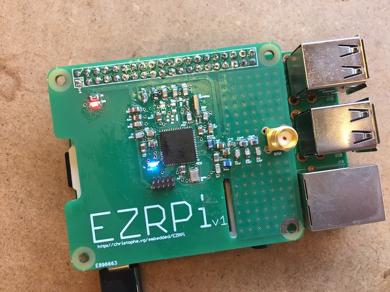

# EZRPi Blink

This example is the most basic example for testing the minimal capabilities of the EZRPi. It only uses the standard [Gecko SDK](../lib/Gecko_SDK) to blink the blue LED.

## Setup

Mount the EZRPi on a Raspberry Pi and power the Pi. The red led near the Pi header should light up, indicating that the EZRPi also is powered.

## Building

```bash
$ make
*** compiling ../../lib/Gecko_SDK/platform/Device/SiliconLabs/EZR32LG/Source/system_ezr32lg.c
*** assembling ../../lib/Gecko_SDK/platform/Device/SiliconLabs/EZR32LG/Source/GCC/startup_ezr32lg.S
*** compiling ../../lib/Gecko_SDK/platform/emlib/src/em_assert.c
*** compiling ../../lib/Gecko_SDK/platform/emlib/src/em_cmu.c
*** compiling ../../lib/Gecko_SDK/platform/emlib/src/em_ebi.c
*** compiling ../../lib/Gecko_SDK/platform/emlib/src/em_emu.c
*** compiling ../../lib/Gecko_SDK/platform/emlib/src/em_gpio.c
*** compiling ../../lib/Gecko_SDK/platform/emlib/src/em_system.c
*** compiling ../../lib/Gecko_SDK/platform/emlib/src/em_usart.c
*** compiling blink.c
*** linking .build/blink.out
*** creating .build/blink.bin
```

## Programming

To program the EZR32, I use a programmer and software from [Segger](https://www.segger.com). Other solutions are possible, but I'm not covering them.

```bash
$  make program
*** generating programming script .build/flash.script
*** programming
SEGGER J-Link Commander V6.14b (Compiled Mar  9 2017 08:48:44)
DLL version V6.14b, compiled Mar  9 2017 08:48:31
...
Downloading file [blink/blink.bin]...
Comparing flash   [100%] Done.
Erasing flash     [100%] Done.
Programming flash [100%] Done.
Verifying flash   [100%] Done.
J-Link: Flash download: Flash programming performed for 1 range (6144 bytes)
J-Link: Flash download: Total time needed: 0.184s (Prepare: 0.066s, Compare: 0.004s, Erase: 0.000s, Program: 0.103s, Verify: 0.001s, Restore: 0.009s)
O.K.
Reset delay: 0 ms
Reset type NORMAL: Resets core & peripherals via SYSRESETREQ & VECTRESET bit.

```

You now should have a blinking blue led near the lower left corner of the microcontroller.


